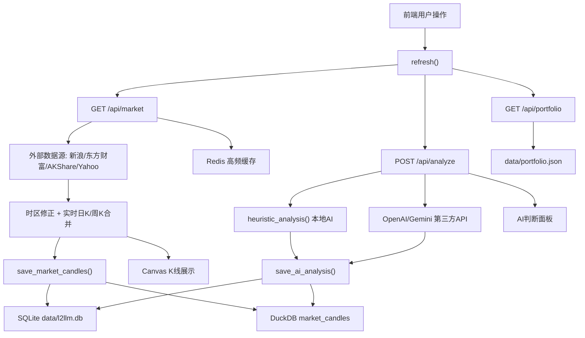
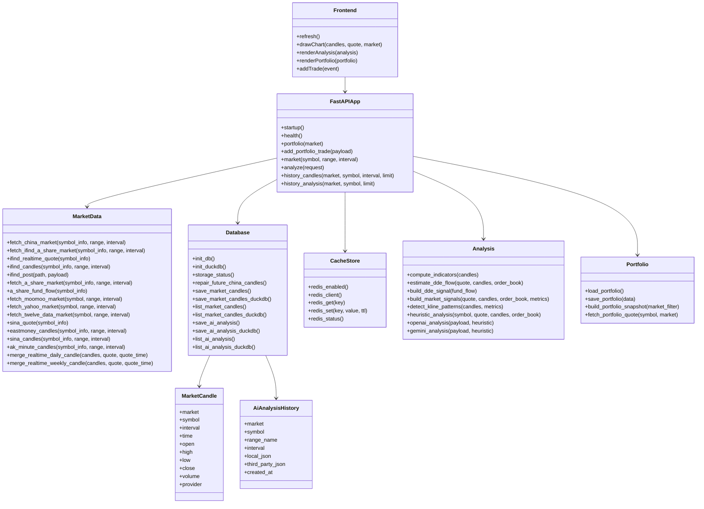
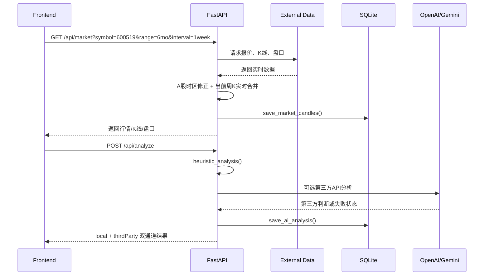

# L2LLM 项目函数与功能结构说明

生成时间：2026-05-26

## 项目概览

L2LLM 是一个本地股票行情研究面板，主后端为 FastAPI，前端为原生 HTML/CSS/JavaScript。系统支持 A 股、美股、港股行情研究，包含 K线、盘口、技术指标、K线形态识别、短线行为信号、本地AI判断、第三方API判断、仓位管理，以及 SQLite 本地历史数据沉淀。

## 文件结构

```text
L2LLM/
  backend/
    main.py                 # FastAPI 主程序、行情源、指标、AI 分析、仓位管理
    db.py                   # SQLite/DuckDB 表结构、历史保存与查询
    cache_store.py          # Redis 高频缓存封装，未启用时自动回退内存缓存
    test.py                 # 环境检查脚本
  data/
    l2llm.db                # SQLite 本地历史数据库
    portfolio.json          # 本地仓位与交易记录
  public/
    index.html              # 页面结构
    app.js                  # 前端请求、K线绘制、渲染逻辑
    styles.css              # 页面样式
  docs/
    project_functions_uml.md
    tech.md
    mindmap.md
    quant-architecture.md
  README.md
  requirements.txt
  run_fastapi.ps1
  package.json
  server.js                 # 旧 Node 原型，已不作为主入口
```

## 核心功能

| 功能 | 说明 | 主要位置 |
|---|---|---|
| A股行情 | iFinD HTTP API 优先，AKShare/东方财富/新浪兜底 | `fetch_china_market`, `fetch_ifind_a_share_market`, `fetch_a_share_market` |
| 美股/港股行情 | Moomoo OpenD 为主，Yahoo Finance 与 Twelve Data 兜底 | `fetch_moomoo_market`, `fetch_yahoo_market`, `fetch_twelve_data_market` |
| 盘口 | A股五档盘口，美股/港股演示盘口 | `sina_quote`, `synthesize_order_book` |
| K线周期 | 分钟、日、周、月、3月、6月，以及 YTD/1Y/3Y/5Y/10Y/ALL | `range_window_ms`, `normalize_interval`, `resample_candles` |
| 周期别名 | `1week`、`1wk`、`1w` 均映射为周K | `normalize_interval`, `is_aggregated_interval` |
| A股时区 | A股K线按 `Asia/Shanghai` 解析，避免时间轴偏移 | `china_market_time_ms`, `china_market_day_ms` |
| 实时日K | `interval=1d` 时用实时报价补/更新今日日K | `merge_realtime_daily_candle` |
| 实时周K | `1week/1wk/1w` 时用实时报价更新当前周K | `merge_realtime_weekly_candle` |
| 技术指标 | MA20、MA60、RSI、量能、支撑压力 | `compute_indicators` |
| DDE资金流向 | A股使用 AKShare/东方财富资金流，美股/港股使用盘口与成交额估算 | `a_share_fund_flow`, `build_dde_signal`, `estimate_dde_flow` |
| 短线信号 | 主力吸筹、游资点火、DDE资金流、诱多、封板概率、风险等级 | `build_market_signals` |
| K线识别 | 趋势、十字星、锤头线、吞没、早晨/黄昏之星、突破/破位 | `detect_kline_patterns` |
| 本地AI判断 | 本地规则输出独立判断 | `heuristic_analysis` |
| 第三方API判断 | OpenAI/Gemini 输出独立判断，不覆盖本地判断 | `openai_analysis`, `gemini_analysis` |
| 高频缓存 | Redis 保存行情、盘口、资金流、iFinD token 等短 TTL 数据；未启用时使用进程内缓存 | `backend/cache_store.py`, `cache_get`, `cache_set` |
| 本地历史数据库 | SQLite 保存 K线历史与 AI 判断历史，并作为外部数据源不可用时的兜底 | `backend/db.py` |
| 分析型历史数据库 | DuckDB 保存 K线历史与 AI 判断历史，适合本地量化回测和批量查询 | `backend/db.py` |
| 仓位管理 | 中国、美国、香港分市场持仓和交易记录 | `build_portfolio_snapshot`, `add_portfolio_trade` |
| 前端绘图 | Canvas K线、均线、成交量、横轴时间刻度、市场涨跌颜色 | `public/app.js` |

## 数据库结构

### `market_candles`

保存历史 K线。SQLite 唯一键为 `market + symbol + interval + time`，重复写入时更新价格、成交量、成交额和数据源；DuckDB 使用同一维度做本地分析型存储，文件位于 `data/l2llm.duckdb`。

| 字段 | 说明 |
|---|---|
| `market` | 市场：`cn/us/hk` |
| `symbol` | 标准化股票代码，例如 `SH600519` |
| `interval` | 周期，例如 `1m/1d/1week/1mo` |
| `time` | 毫秒时间戳 |
| `open/high/low/close` | OHLC |
| `volume` | 成交量 |
| `amount` | 成交额 |
| `provider` | 数据源 |
| `created_at` | 写入时间 |

### `ai_analysis_history`

保存每次 AI 判断历史。

| 字段 | 说明 |
|---|---|
| `market` | 市场 |
| `symbol` | 股票代码 |
| `range_name` | 前端 range |
| `interval` | 前端 interval |
| `local_json` | 本地AI判断结果 |
| `third_party_json` | 第三方API判断结果 |
| `created_at` | 写入时间 |

## 后端函数清单

### 数据库模块 `backend/db.py`

| 函数/类 | 用途 |
|---|---|
| `Base` | SQLAlchemy Declarative Base |
| `MarketCandle` | K线历史 ORM 模型 |
| `AiAnalysisHistory` | AI判断历史 ORM 模型 |
| `init_db` | 创建数据库表并执行历史修复 |
| `repair_future_china_candles` | 修复早期 A股时区错误造成的未来时间戳/重复日K |
| `ensure_sqlite_columns` | 为既有 SQLite 表补齐新增列 |
| `duckdb_enabled` | 判断是否启用 DuckDB |
| `duckdb_connect` | 创建 DuckDB 本地连接 |
| `init_duckdb` | 创建 DuckDB 历史表 |
| `normalize_json` | 将复杂对象转为可 JSON 存储结构 |
| `save_market_candles` | 保存/更新 K线历史 |
| `save_market_candles_duckdb` | 写入 DuckDB K线历史 |
| `list_market_candles` | 查询 K线历史 |
| `list_market_candles_duckdb` | 查询 DuckDB K线历史 |
| `save_ai_analysis` | 保存本地AI和第三方API判断历史 |
| `save_ai_analysis_duckdb` | 写入 DuckDB AI 判断历史 |
| `list_ai_analysis` | 查询 AI判断历史 |
| `list_ai_analysis_duckdb` | 查询 DuckDB AI 判断历史 |
| `storage_status` | 返回 SQLite/DuckDB 当前状态 |

### 缓存模块 `backend/cache_store.py`

| 函数 | 用途 |
|---|---|
| `redis_enabled` | 判断是否启用 Redis |
| `redis_client` | 创建 Redis 客户端，连接失败时记录错误并回退 |
| `redis_get` | 从 Redis 读取 JSON 缓存 |
| `redis_set` | 写入带 TTL 的 Redis JSON 缓存 |
| `redis_status` | 返回 Redis 当前状态 |

### 通用工具

| 函数 | 用途 |
|---|---|
| `startup` | FastAPI 启动时初始化数据库 |
| `now_iso` | 返回当前 UTC ISO 时间 |
| `cache_get` | TTL 缓存读取 |
| `cache_set` | TTL 缓存写入，同时写入 Redis 和进程内缓存 |
| `finite` | 安全转换数字，过滤 NaN/Inf |
| `china_market_time_ms` | 将 A股行情时间按上海时区转毫秒时间戳 |
| `china_market_day_ms` | 将 A股行情日期归一到上海时区日线起点 |
| `range_window_ms` | 将 range 转换为毫秒窗口 |
| `normalize_interval` | 将前端 interval 映射为数据源周期 |
| `is_aggregated_interval` | 判断是否为周/月/季/半年聚合周期 |
| `resample_candles` | 用 Pandas 聚合周K、月K、3月K、6月K |
| `http_json` | 带缓存的异步 JSON 请求 |
| `http_text` | 带缓存的异步文本请求 |
| `run_blocking` | 在线程中执行阻塞函数 |
| `run_blocking_timeout` | 阻塞函数限时执行 |
| `df_records` | DataFrame 转 JSON records |
| `clamp` | 限制数值范围 |
| `label_by_score` | 将分数映射为标签 |

### 股票代码与市场

| 函数 | 用途 |
|---|---|
| `normalize_a_share_symbol` | 支持 `600519`、`SH600519`、`600519.SH` 等格式 |
| `normalize_market_response_symbol` | 标准化行情/历史查询股票代码 |
| `portfolio_symbol_key` | 组合仓位使用的股票代码键 |
| `normalize_portfolio_market` | 推断或标准化仓位市场 |
| `normalize_portfolio_symbol` | 标准化仓位股票代码 |

### 仓位管理

| 函数 | 用途 |
|---|---|
| `load_portfolio` | 读取本地仓位文件 |
| `save_portfolio` | 保存本地仓位文件 |
| `fetch_portfolio_quote` | 获取仓位股票现价 |
| `empty_portfolio_summary` | 空仓位汇总 |
| `summarize_portfolio_rows` | 汇总仓位收益和交易数 |
| `build_portfolio_snapshot` | 生成分市场仓位快照 |

### 数据源与K线

| 函数 | 用途 |
|---|---|
| `ak_bid_ask` | AKShare 五档盘口，可选增强 |
| `ak_minute_candles` | AKShare 分钟/日线/聚合K线 |
| `normalize_ak_candles` | AKShare DataFrame 标准化 |
| `eastmoney_candles` | 东方财富 K线 |
| `sina_candles` | 新浪 K线 |
| `sina_quote` | 新浪报价和五档盘口 |
| `merge_realtime_daily_candle` | 用实时报价补/更新今日日K |
| `same_china_week` | 判断两个时间戳是否处于同一中国交易周 |
| `merge_realtime_weekly_candle` | 用实时报价更新当前周K |
| `fetch_a_share_market` | A股行情聚合入口 |
| `fetch_yahoo_market` | 美股/港股行情入口 |
| `synthesize_order_book` | 美股/港股演示盘口 |

### 分析模块

| 函数 | 用途 |
|---|---|
| `compute_indicators` | 计算 MA、RSI、量能、支撑压力 |
| `build_market_signals` | 判断主力吸筹、游资点火、诱多、封板概率、风险等级 |
| `detect_kline_patterns` | 识别K线趋势与形态 |
| `heuristic_analysis` | 本地AI判断入口 |
| `ai_analysis` | 根据环境变量选择 OpenAI/Gemini |
| `third_party_unavailable` | 第三方API未启用或失败时的独立状态 |
| `compact_payload` | 第三方API请求压缩行情上下文 |
| `openai_analysis` | OpenAI Responses API 分析 |
| `gemini_analysis` | Gemini generateContent 分析 |

### API 路由

| 路由函数 | HTTP | 路径 | 用途 |
|---|---|---|---|
| `health` | GET | `/api/health` | 健康检查、AI配置、功能开关 |
| `portfolio` | GET | `/api/portfolio` | 仓位快照 |
| `add_portfolio_trade` | POST | `/api/portfolio/trades` | 新增交易 |
| `market` | GET | `/api/market` | 实时行情、K线、盘口，并保存K线历史 |
| `analyze` | POST | `/api/analyze` | 本地AI与第三方API双通道分析，并保存AI历史 |
| `history_candles` | GET | `/api/history/candles` | 查询本地K线历史 |
| `history_analysis` | GET | `/api/history/analysis` | 查询本地AI判断历史 |
| `all_exception_handler` | exception | 全局 | 统一错误返回 |

## 前端函数清单

| 函数 | 用途 |
|---|---|
| `money` | 金额/价格格式化 |
| `compact` | 成交量压缩格式 |
| `pct` | 百分比格式化 |
| `formatAxisTime` | K线横轴时间格式化 |
| `signedMoney` | 带正负号的金额格式化 |
| `setStatus` | 更新状态徽章 |
| `isChinaMarket` | 判断是否为 A股市场 |
| `marketColors` | 根据市场返回涨跌颜色规则 |
| `updateQuote` | 渲染报价卡片 |
| `drawChart` | Canvas 绘制K线、均线、成交量和横轴 |
| `drawAverage` | 绘制均线 |
| `renderBook` | 渲染盘口 |
| `renderList` | 渲染依据/风险列表 |
| `toneClass` | 收益正负颜色 |
| `renderPortfolio` | 渲染仓位管理模块 |
| `fetchPortfolio` | 请求仓位快照 |
| `addTrade` | 新增交易 |
| `signalText` | 信号标签格式化 |
| `decisionTone` | AI方向映射颜色：偏多红色、偏空绿色、震荡黄色 |
| `renderAnalysis` | 渲染本地AI和第三方API判断 |
| `fetchAnalysis` | 请求 AI 分析 |
| `refresh` | 刷新行情、盘口、AI、仓位 |
| `schedule` | 定时刷新 |

## 数据流



## UML 类图



## API 时序图


