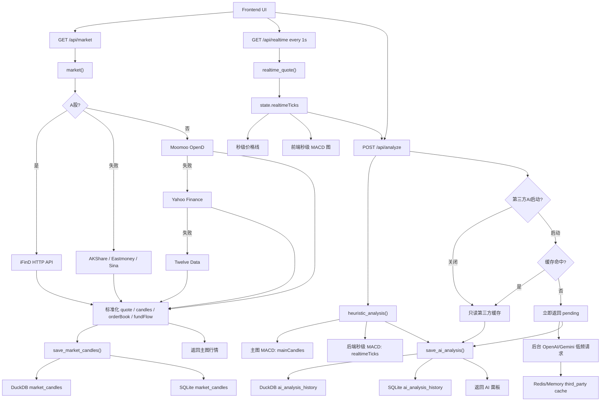
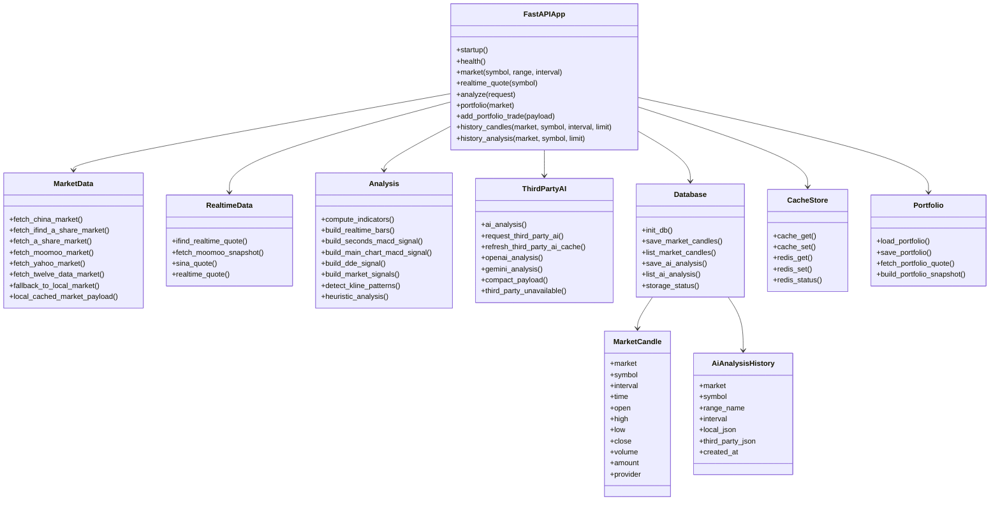
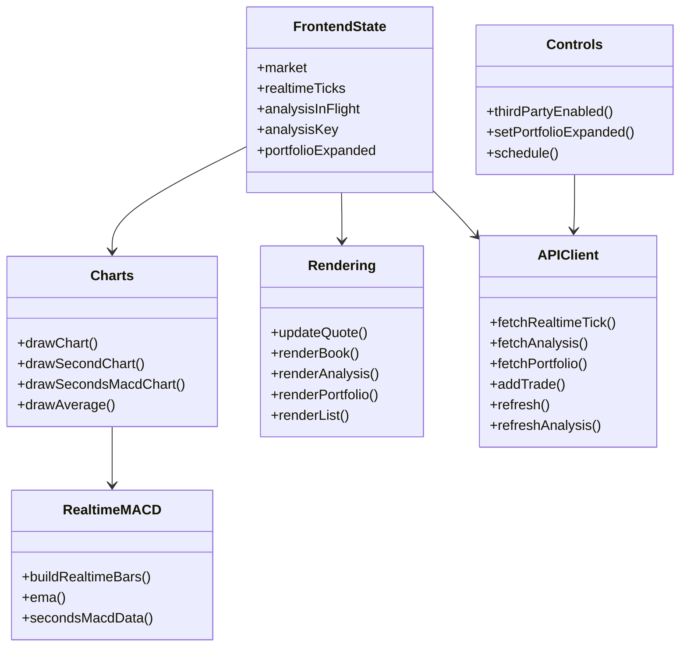
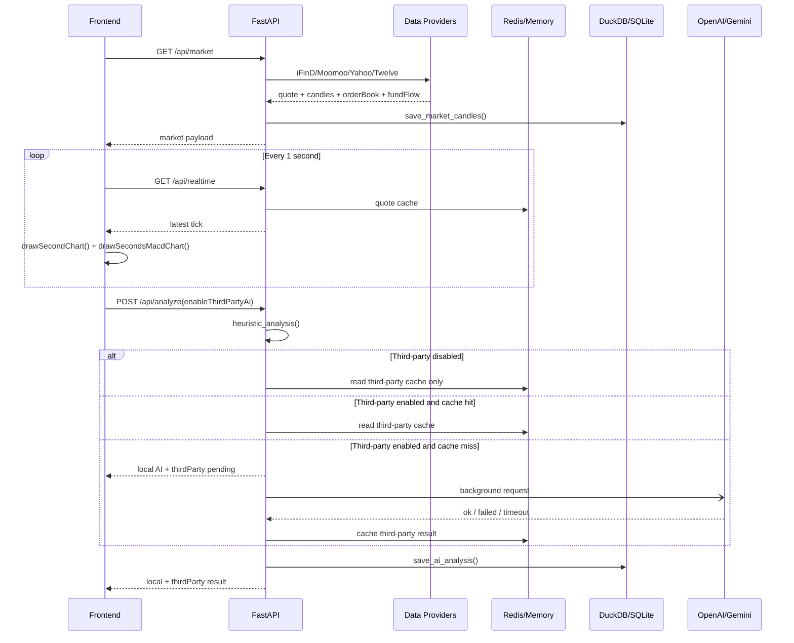
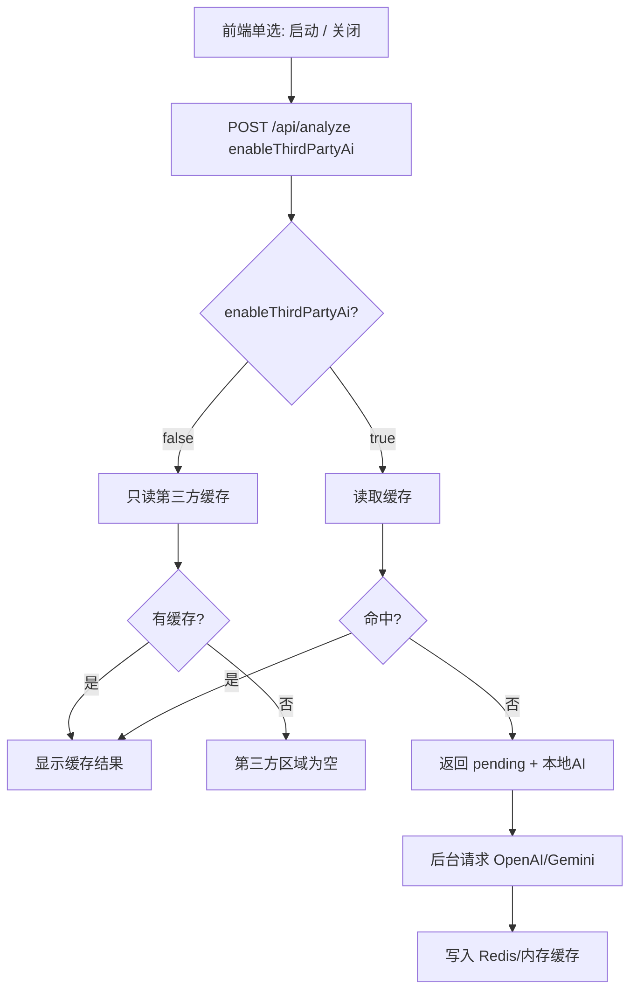
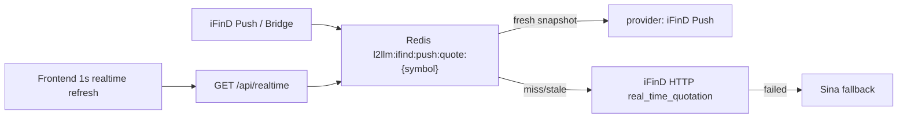

# L2LLM 项目函数、功能与 UML 结构说明

更新时间：2026-05-29

## 项目概览

L2LLM 是一个本地股票行情研究面板。后端使用 FastAPI，前端使用原生 HTML/CSS/JavaScript，支持中国 A 股、美股、港股三类市场。系统包含行情、盘口、K线、秒级 tick、主图 MACD、秒级 MACD、DDE 资金流、本地 AI 判断、第三方 OpenAI/Gemini 复核、仓位管理、Redis 高频缓存，以及 SQLite + DuckDB 本地历史存储。

系统输出仅用于行情研究和策略辅助，不构成投资建议。

## 文件结构

```text
L2LLM/
  backend/
    main.py                 # FastAPI 主程序、行情源、指标、AI 分析、仓位管理
    db.py                   # SQLite/DuckDB 表结构、历史保存与查询
    cache_store.py          # Redis 高频缓存封装
    test.py                 # 环境检查脚本
  data/
    l2llm.db                # SQLite 本地历史库
    l2llm.duckdb            # DuckDB 本地分析库
    portfolio.json          # 本地仓位与交易记录
  docs/
    project_functions_uml.md
    tech.md
    mindmap.md
    quant-architecture.md
  public/
    index.html              # 页面结构
    app.js                  # 前端请求、绘图、渲染与秒级 MACD
    styles.css              # 页面样式
  scripts/
    openai_probe.py         # OpenAI 最小连通性诊断脚本
  README.md
  requirements.txt
  run_fastapi.ps1
  docker-compose.storage.yml
  server.js                 # 旧 Node 原型，当前不作为主入口
```

## 当前核心功能

| 功能 | 说明 | 主要位置 |
|---|---|---|
| A 股行情 | iFinD HTTP API 优先，失败后回退 AKShare/Eastmoney/Sina | `fetch_china_market`, `fetch_ifind_a_share_market`, `fetch_a_share_market` |
| 美股/港股行情 | Moomoo OpenD 优先，失败后回退 Yahoo Finance，再回退 Twelve Data | `fetch_moomoo_market`, `fetch_yahoo_market`, `fetch_twelve_data_market` |
| 实时 quote | `/api/realtime` 每秒轻量获取最新价，用于秒级 tick 图和秒级 MACD | `realtime_quote`, `fetchRealtimeTick` |
| 主图 K线 | 支持 `1d/5d/1mo/3mo/6mo/ytd/1y/3y/5y/10y/all` 范围 | `market`, `range_window_ms` |
| K线周期 | 支持 `1m/2m/5m/15m/30m/60m/1d/1wk/1mo/3mo/6mo` | `normalize_interval`, `resample_candles` |
| 本地历史兜底 | 外部数据源不可用时读取本地 K线历史 | `fallback_to_local_market`, `local_cached_market_payload` |
| 主图 MACD | 始终基于主图 candles，随 range/interval 变化 | `build_main_chart_macd_signal` |
| 秒级 MACD | 始终基于独立当日实时 ticks，聚合 3 秒 bar，不受主图周期影响 | `build_realtime_bars`, `build_seconds_macd_signal`, `secondsMacdData` |
| 秒级 MACD 图 | 前端每秒绘制 DIF、DEA、MACD 柱体和信号示意 | `drawSecondsMacdChart` |
| DDE 资金流 | A 股使用 AKShare/Eastmoney，其他市场用盘口和成交额估算 | `a_share_fund_flow`, `estimate_dde_flow`, `build_dde_signal` |
| 短线行为信号 | 主力吸筹、游资点火、诱多、封板概率、风险等级 | `build_market_signals` |
| K线形态识别 | 趋势、十字星、锤头线、吞没、晨星/昏星、突破/破位等 | `detect_kline_patterns` |
| 本地 AI 判断 | 本地规则即时生成方向、置信度、理由和风险 | `heuristic_analysis` |
| 第三方 AI 复核 | OpenAI/Gemini 后台低频复核，不阻塞本地 AI | `ai_analysis`, `refresh_third_party_ai_cache` |
| 第三方 AI 开关 | 前端“启动/关闭”单选；关闭时只读缓存，不再请求第三方 AI | `thirdPartyEnabled`, `enableThirdPartyAi`, `ai_analysis` |
| Redis 缓存 | 高频行情、数据源响应、iFinD token、第三方 AI 结果等 TTL 缓存 | `cache_store.py`, `cache_get`, `cache_set` |
| DuckDB 存储 | K线历史和 AI 判断历史的本地分析型存储 | `db.py` |
| SQLite 存储 | 轻量持久化与本地兜底存储 | `db.py` |
| 仓位管理 | 中国/美国/香港分市场管理持仓、收益率、交易止盈止损 | `build_portfolio_snapshot`, `add_portfolio_trade` |
| 市场颜色 | 当前统一为上涨红色、下跌绿色 | `marketColors`, `styles.css` |

## 缓存与存储机制

### Redis / 内存缓存

`cache_get()` 先读 Redis，Redis 未命中再读进程内缓存。`cache_set()` 同时写入进程内缓存和 Redis。Redis key 使用 `l2llm:` 前缀。

典型 TTL：

| 数据 | TTL |
|---|---:|
| `/api/realtime` 秒级 quote | 1 秒 |
| Moomoo snapshot | 默认 5 秒，实时接口 1 秒 |
| Moomoo 分钟 K线 | 8 到 20 秒 |
| Moomoo 日/周/月 K线 | 60 到 180 秒 |
| AKShare 分钟 K线 | 6 秒 |
| iFinD access token | 1 小时 |
| 第三方 AI 结果 | 默认 300 秒 |

### SQLite + DuckDB

`save_market_candles()` 保存 K线时会先去重，再写 DuckDB，随后写 SQLite。SQLite 对 `(market, symbol, interval, time)` 做唯一键冲突更新，避免重复 K线插入报错。查询历史时优先读 DuckDB，DuckDB 不可用或无数据时回退 SQLite。

`save_ai_analysis()` 同时保存本地 AI 和第三方 AI 结果到 DuckDB 与 SQLite。查询时同样 DuckDB 优先。

### `market_candles`

| 字段 | 说明 |
|---|---|
| `market` | 市场：`cn/us/hk` |
| `symbol` | 标准化股票代码 |
| `interval` | K线周期 |
| `time` | 毫秒时间戳 |
| `open/high/low/close` | OHLC |
| `volume` | 成交量 |
| `amount` | 成交额 |
| `provider` | 数据源 |
| `created_at` | 写入时间 |

### `ai_analysis_history`

| 字段 | 说明 |
|---|---|
| `market` | 市场 |
| `symbol` | 股票代码 |
| `range_name` | 前端 range |
| `interval` | 前端 interval |
| `local_json` | 本地 AI 判断结果 |
| `third_party_json` | 第三方 AI 复核结果 |
| `created_at` | 写入时间 |

## 后端函数清单

### `backend/cache_store.py`

| 函数 | 用途 |
|---|---|
| `redis_enabled` | 判断是否启用 Redis |
| `redis_client` | 创建 Redis 客户端，连接失败时记录错误 |
| `redis_get` | 读取 Redis JSON 缓存 |
| `redis_set` | 写入带 TTL 的 Redis JSON 缓存 |
| `redis_status` | 返回 Redis 运行状态 |

### `backend/db.py`

| 函数/类 | 用途 |
|---|---|
| `Base` | SQLAlchemy declarative base |
| `MarketCandle` | K线历史 ORM 模型 |
| `AiAnalysisHistory` | AI 判断历史 ORM 模型 |
| `init_db` | 初始化 SQLite、补列、修复历史时间戳、初始化 DuckDB |
| `ensure_sqlite_columns` | 为旧 SQLite 表补齐新列 |
| `duckdb_enabled` | 判断 DuckDB 是否启用 |
| `duckdb_connect` | 创建 DuckDB 连接 |
| `init_duckdb` | 创建 DuckDB 历史表 |
| `repair_future_china_candles` | 修复早期 A 股时间戳偏移数据 |
| `normalize_json` | 转换为可 JSON 存储结构 |
| `save_market_candles` | 保存/更新 K线历史到 DuckDB 和 SQLite |
| `save_market_candles_duckdb` | DuckDB K线 delete-then-insert 写入 |
| `list_market_candles` | 查询 K线历史，DuckDB 优先 |
| `list_market_candles_duckdb` | 查询 DuckDB K线历史 |
| `save_ai_analysis` | 保存 AI 判断历史到 DuckDB 和 SQLite |
| `save_ai_analysis_duckdb` | 写入 DuckDB AI 判断历史 |
| `list_ai_analysis` | 查询 AI 判断历史，DuckDB 优先 |
| `list_ai_analysis_duckdb` | 查询 DuckDB AI 判断历史 |
| `storage_status` | 返回 SQLite/DuckDB 状态 |

### `backend/main.py` 通用工具

| 函数 | 用途 |
|---|---|
| `startup` | FastAPI 启动时初始化数据库 |
| `now_iso` | 当前 UTC ISO 时间 |
| `cache_get` | Redis/内存缓存读取 |
| `cache_set` | Redis/内存缓存写入 |
| `finite` | 安全数值转换 |
| `china_market_time_ms` | A 股时间转上海时区毫秒时间戳 |
| `china_market_day_ms` | A 股日期转上海时区日线时间戳 |
| `range_window_ms` | range 转毫秒窗口 |
| `normalize_interval` | 周期别名标准化 |
| `is_aggregated_interval` | 判断是否周/月/季/半年聚合周期 |
| `resample_candles` | Pandas 聚合 K线 |
| `http_json` | 带缓存的异步 JSON 请求 |
| `http_text` | 带缓存的异步文本请求 |
| `http_json_params` | 带 query params 的异步 JSON 请求 |
| `run_blocking` | 在线程中运行阻塞函数 |
| `run_blocking_timeout` | 阻塞函数限时运行 |
| `df_records` | DataFrame 转 records |
| `numeric_series` | 安全读取数值列 |
| `clamp` | 数值范围限制 |
| `label_by_score` | 分数转标签 |

### 股票代码与仓位

| 函数 | 用途 |
|---|---|
| `normalize_a_share_symbol` | 识别并标准化 A 股代码 |
| `normalize_market_response_symbol` | 标准化返回/历史查询股票代码 |
| `load_portfolio` | 读取本地仓位文件 |
| `save_portfolio` | 保存本地仓位文件 |
| `portfolio_symbol_key` | 仓位 symbol key |
| `normalize_portfolio_market` | 标准化仓位市场 |
| `normalize_portfolio_symbol` | 标准化仓位 symbol |
| `fetch_portfolio_quote` | 获取仓位股票现价 |
| `empty_portfolio_summary` | 空仓位汇总 |
| `summarize_portfolio_rows` | 汇总持仓收益和交易数量 |
| `build_portfolio_snapshot` | 生成仓位快照 |

### iFinD 与 A 股数据

| 函数 | 用途 |
|---|---|
| `ifind_enabled` | 判断 iFinD 是否启用 |
| `ifind_a_share_code` | 转换为 iFinD A 股代码 |
| `ifind_access_token` | 获取/缓存 iFinD access token |
| `ifind_token_error` | 判断 iFinD token 错误 |
| `ifind_post` | 调用 iFinD HTTP API |
| `ifind_table_rows` | 提取 iFinD 表格 rows |
| `ifind_first_row` | 提取 iFinD 第一行 |
| `row_get` | 多字段名兼容读取 |
| `ifind_range_dates` | range 转 iFinD 日期范围 |
| `ifind_high_frequency_times` | 高频数据时间窗口 |
| `ifind_history_interval` | 历史 K线周期映射 |
| `ifind_minute_interval` | 分钟 K线周期映射 |
| `ifind_realtime_quote` | iFinD 实时 quote |
| `normalize_ifind_candles` | iFinD K线标准化 |
| `ifind_candles` | iFinD K线获取 |
| `fetch_ifind_a_share_market` | iFinD A 股行情聚合 |
| `fetch_china_market` | A 股主入口，iFinD 优先，失败 fallback |
| `ak_bid_ask` | AKShare 五档盘口 |
| `a_share_fund_flow` | A 股资金流 |
| `ak_minute_candles` | AKShare K线 |
| `normalize_ak_candles` | AKShare K线标准化 |
| `eastmoney_candles` | Eastmoney K线 |
| `sina_candles` | Sina K线 |
| `sina_quote` | Sina quote/盘口 |
| `merge_realtime_daily_candle` | 实时报价合并日K |
| `same_china_week` | 判断同一中国交易周 |
| `merge_realtime_weekly_candle` | 实时报价合并周K |
| `fetch_a_share_market` | AKShare/Eastmoney/Sina A 股 fallback 入口 |

### 美股/港股数据

| 函数 | 用途 |
|---|---|
| `fetch_yahoo_market` | Yahoo Finance fallback |
| `twelve_data_api_key` | Twelve Data key 读取 |
| `moomoo_enabled` | Moomoo OpenD 开关 |
| `moomoo_host` | OpenD host |
| `moomoo_port` | OpenD port |
| `moomoo_symbol` | 股票代码映射为 Moomoo 代码 |
| `moomoo_ktype` | interval 转 Moomoo KType |
| `moomoo_date_window` | range 转 Moomoo 日期窗口 |
| `parse_moomoo_time` | Moomoo 时间解析 |
| `normalize_moomoo_frame` | Moomoo K线标准化 |
| `moomoo_import` | 动态导入 moomoo SDK |
| `moomoo_kline_ttl` | Moomoo K线 TTL |
| `fetch_moomoo_candles_sync` | 同步获取 Moomoo K线 |
| `fetch_moomoo_snapshot_sync` | 同步获取 Moomoo snapshot |
| `fetch_moomoo_candles` | 异步缓存 Moomoo K线 |
| `fetch_moomoo_snapshot` | 异步缓存 Moomoo snapshot |
| `fetch_moomoo_market` | Moomoo 行情聚合 |
| `twelve_data_symbol` | Twelve Data symbol 映射 |
| `twelve_data_interval` | Twelve Data interval 映射 |
| `twelve_data_output_size` | Twelve Data 输出长度 |
| `parse_twelve_time` | Twelve Data 时间解析 |
| `fetch_twelve_data_market` | Twelve Data fallback |
| `synthesize_order_book` | 合成盘口 |

### 分析与 AI

| 函数 | 用途 |
|---|---|
| `compute_indicators` | MA、RSI、量能、支撑压力 |
| `estimate_dde_flow` | 估算 DDE 资金流 |
| `build_dde_signal` | 资金流评分和标签 |
| `build_realtime_bars` | 实时 ticks 聚合为 3 秒 bar |
| `build_seconds_macd_signal` | 独立秒级 MACD 信号 |
| `build_main_chart_macd_signal` | 主图 candles MACD 信号 |
| `build_market_signals` | 主力吸筹、游资点火、DDE、诱多、封板概率、风险等级 |
| `detect_kline_patterns` | K线趋势和形态识别 |
| `heuristic_analysis` | 本地 AI 判断入口 |
| `ai_analysis_blocking_legacy` | 旧同步第三方 AI 流程，保留但不作为当前入口 |
| `request_third_party_ai` | 有超时边界的第三方 AI 请求 |
| `refresh_third_party_ai_cache` | 后台刷新第三方 AI 缓存 |
| `ai_analysis` | 当前第三方 AI 入口：缓存优先、开关控制、后台低频请求 |
| `third_party_unavailable` | 第三方不可用/关闭/pending/timeout 状态 |
| `compact_payload` | 压缩第三方 AI 上下文 |
| `openai_analysis` | OpenAI Responses API 复核 |
| `gemini_analysis` | Gemini generateContent 复核 |

### API 路由

| 路由函数 | HTTP | 路径 | 用途 |
|---|---|---|---|
| `health` | GET | `/api/health` | 健康检查、缓存、存储和 AI 配置状态 |
| `portfolio` | GET | `/api/portfolio` | 仓位快照 |
| `add_portfolio_trade` | POST | `/api/portfolio/trades` | 新增交易 |
| `market` | GET | `/api/market` | 行情、K线、盘口、资金流，并保存 K线历史 |
| `realtime_quote` | GET | `/api/realtime` | 秒级轻量 quote |
| `analyze` | POST | `/api/analyze` | 本地 AI + 第三方 AI 复核，并保存历史 |
| `history_candles` | GET | `/api/history/candles` | 查询本地 K线历史 |
| `history_analysis` | GET | `/api/history/analysis` | 查询 AI 判断历史 |
| `all_exception_handler` | exception | 全局 | 统一错误返回 |

## 前端函数清单

| 函数 | 用途 |
|---|---|
| `money` | 价格/金额格式化 |
| `compact` | 成交量压缩格式化 |
| `pct` | 百分比格式化 |
| `signedMoney` | 带正负号金额格式化 |
| `formatAxisTime` | K线横轴时间格式化 |
| `setPortfolioExpanded` | 折叠/展开仓位面板 |
| `setStatus` | 状态徽章 |
| `isChinaMarket` | 判断 A 股市场 |
| `marketColors` | 涨跌颜色，当前红涨绿跌 |
| `updateQuote` | 渲染顶部报价 |
| `chartWindowSize` | 主图显示窗口长度 |
| `drawChart` | Canvas 主图 K线、均线、成交量、横轴 |
| `drawAverage` | 主图均线 |
| `todayKey` | 当日 tick 日期 key |
| `resetRealtime` | 切换 symbol 时清空实时 ticks |
| `buildRealtimeBars` | 前端实时 ticks 聚合为 3 秒 bar |
| `ema` | 前端 EMA |
| `secondsMacdData` | 前端秒级 MACD 计算 |
| `drawSecondsMacdChart` | 绘制秒级 MACD 图 |
| `drawSecondChart` | 绘制秒级价格线 |
| `fetchRealtimeTick` | 每秒请求 `/api/realtime` |
| `renderBook` | 渲染盘口 |
| `renderList` | 渲染理由/风险列表 |
| `toneClass` | 收益颜色 |
| `renderPortfolio` | 渲染仓位 |
| `fetchPortfolio` | 请求仓位快照 |
| `addTrade` | 保存交易 |
| `signalText` | 信号文本 |
| `thirdPartyEnabled` | 读取第三方 AI 启动/关闭单选状态 |
| `decisionTone` | AI 方向颜色 |
| `renderAnalysis` | 渲染本地 AI 和第三方 AI |
| `fetchAnalysis` | POST `/api/analyze` |
| `analysisRequestKey` | AI 请求去重 key |
| `refreshAnalysis` | 独立刷新 AI，不被行情刷新 abort |
| `refresh` | 主行情刷新 |
| `schedule` | 主图 15 秒、实时 quote 1 秒定时 |

## 数据流 UML



## 后端 UML 类图



## 前端 UML 类图



## API 时序图



## 第三方 AI 开关流程



## iFinD Push Snapshot Flow

当前已落地 iFinD 推送缓存消费层。正式推送 SDK 接入前，可使用 `scripts/ifind_push_bridge.py` 将 iFinD HTTP 实时报价按同一格式写入 Redis，后端读取逻辑保持不变。



| 函数/脚本 | 用途 |
|---|---|
| `ifind_push_enabled` | 判断是否启用 iFinD Push 快照优先 |
| `set_ifind_push_quote` | 写入 Redis 推送 quote 快照 |
| `get_ifind_push_quote` | 读取并校验 Redis 推送 quote 是否过期 |
| `pushed_quote_to_ifind_shape` | 将推送快照转换为当前 iFinD quote shape |
| `scripts/ifind_push_bridge.py` | 临时 HTTP 桥接脚本，模拟推送写入 Redis |
# 注意

本文档是重构前生成的函数与 UML 快照。当前本地分析主链路已经迁移到
`backend/analysis/`，`backend/main.py` 中的旧分析函数已在第五阶段删除。
请以 `docs/architecture_refactor_phase_1_2.md` 和当前代码为准；后续需要时可重新生成本文件。
